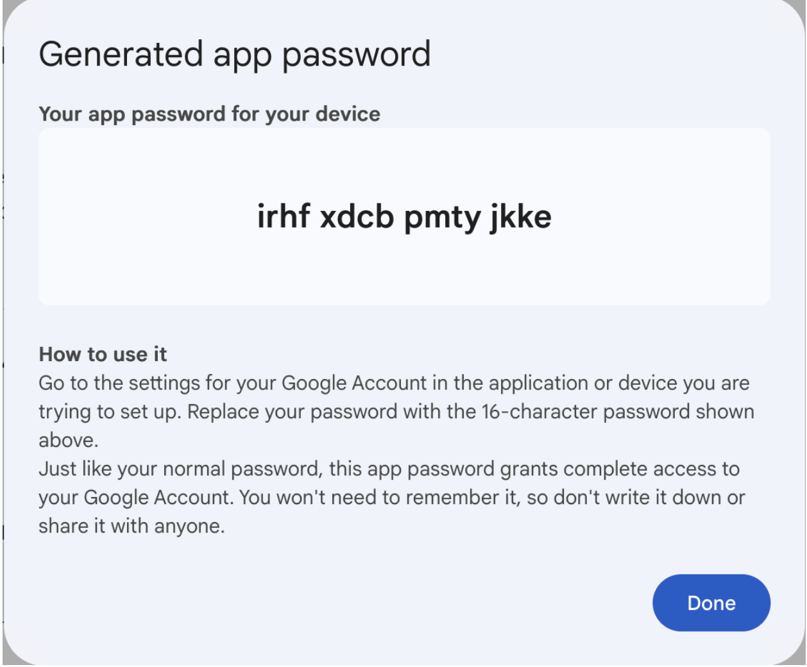
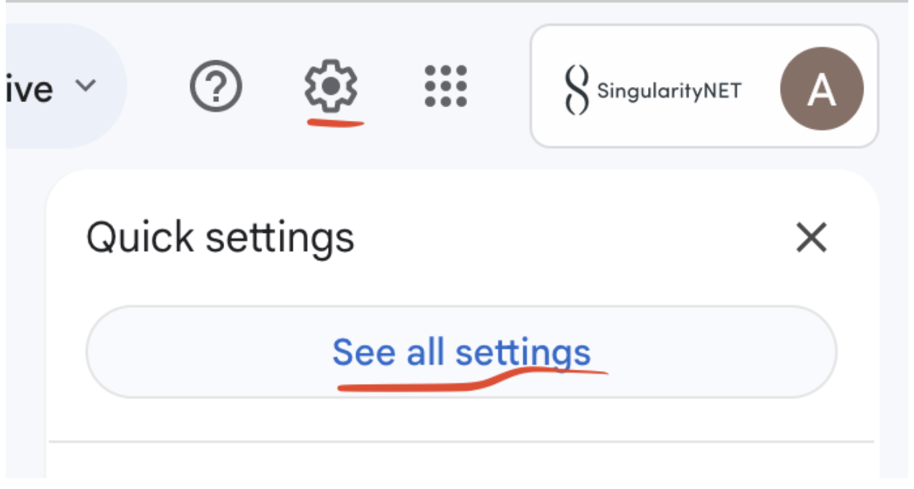
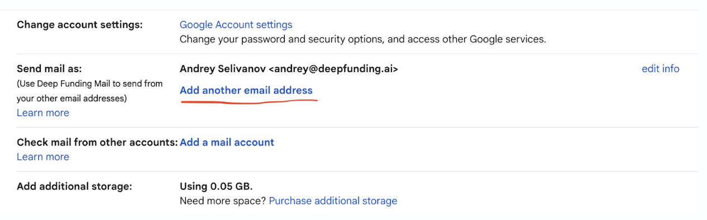
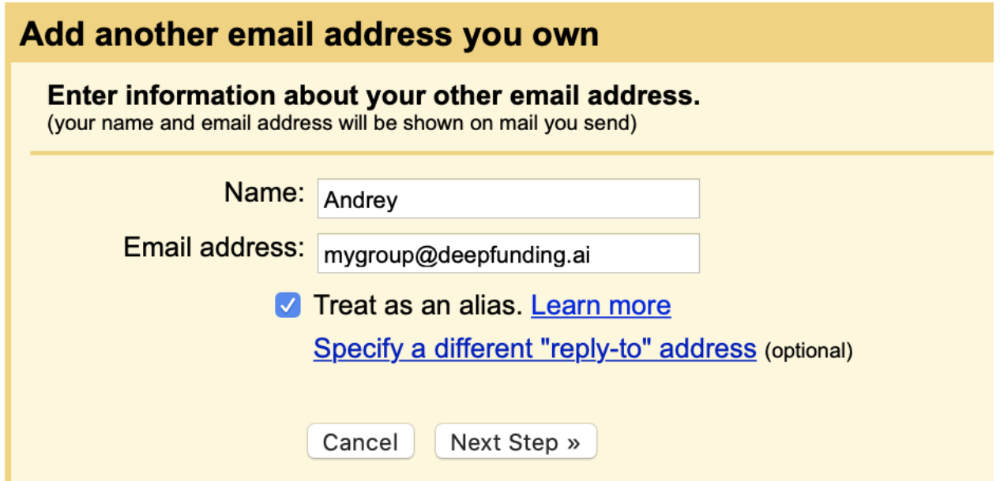
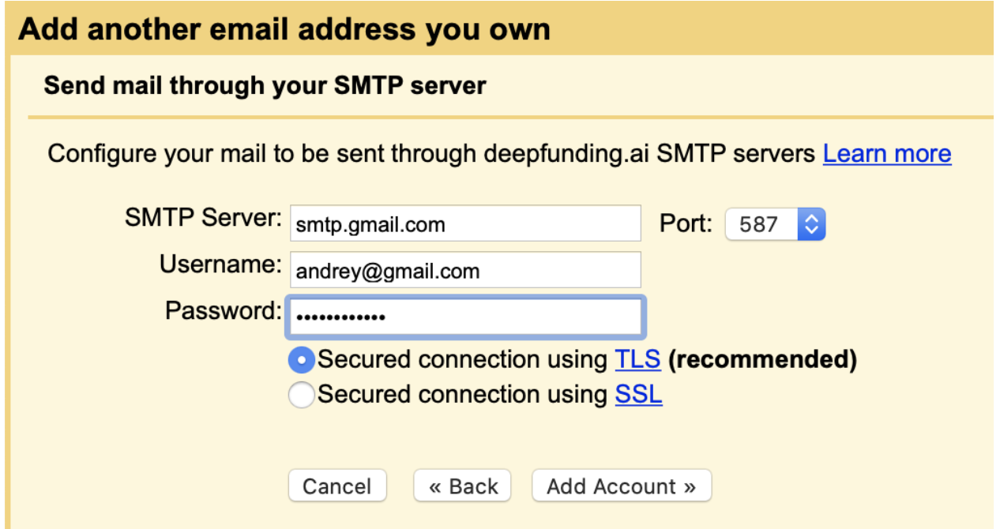

# __📧 Adding DF email alias on Gmail__

## Step 1:  Create an Application password.

- Go to https://myaccount.google.com/apppasswords
- Sign into your Google Workspace account
- Name your application.  “Gmail” works well for this app
- Copy the password key and save it somewhere safe. (Note! The password will be 16 symbols without spaces)

<!-- image -->

## Step 2:  Adding an Alias

- Go to your Gmail account (the one you want to add the group alias to)
- Go to settings

<!-- image -->

- Go to accounts and importComment
- Scroll down to: “Send mail as”Comment
- Click “Add another email address"

<!-- image -->

- Add the Google group email address that you want to useComment
- Make sure the check mark is next to “use as an alias”

<!-- image -->

- Click “Next Step”
- In the SMTP, type: smtp.gmail.com
- In the username, type your Gmail username
- In the password, paste the Google app key you got in Step 1

<!-- image -->

## Step 3: Verify

1. Check email of current email address
2. Copy and paste verification code
3. Click Verify

<mark></mark>